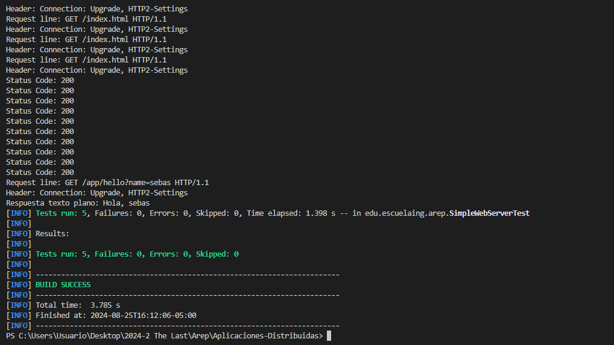
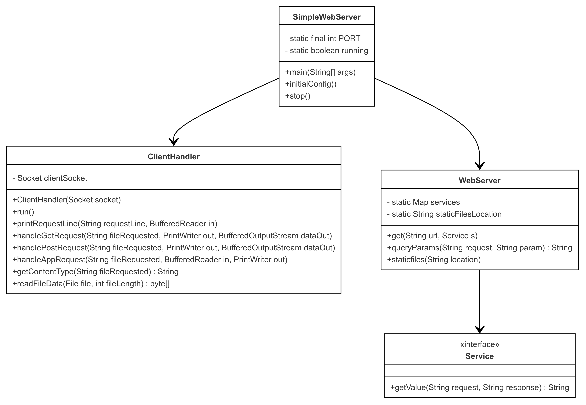
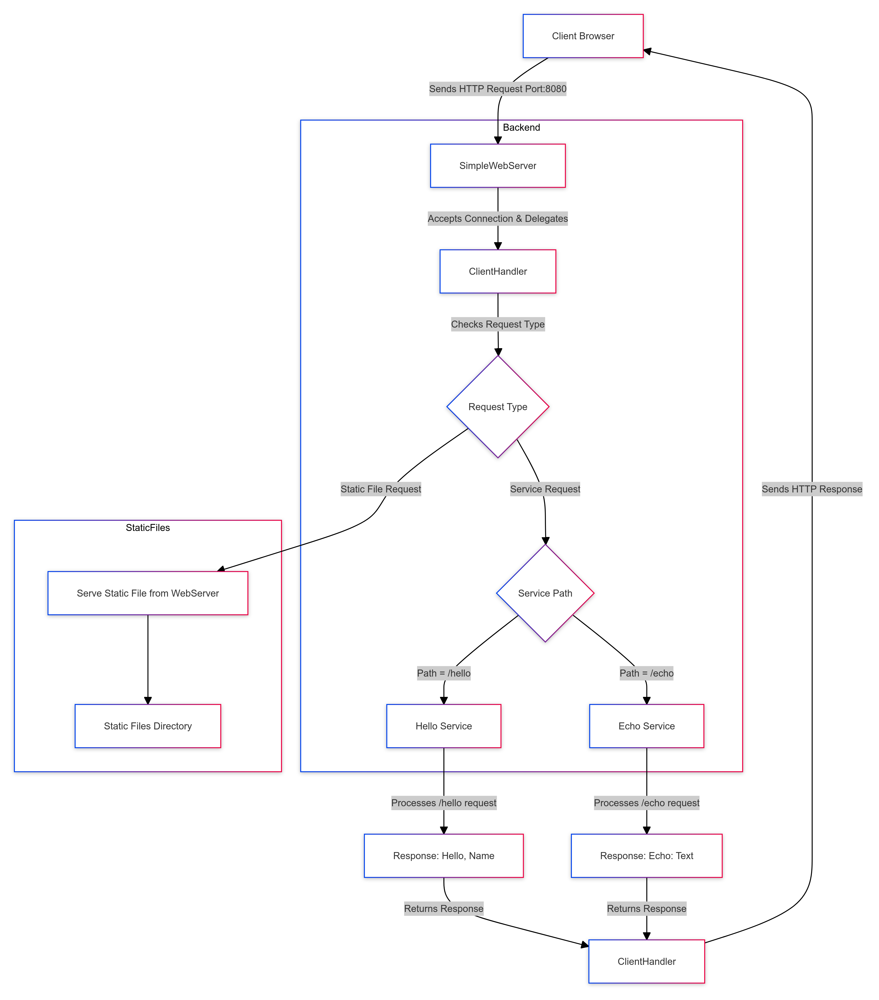
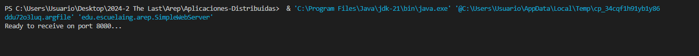
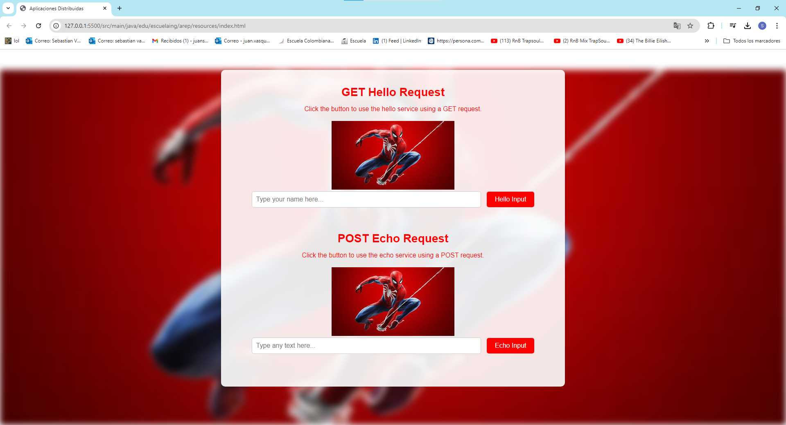

# Microframeworks WEB

This repository contains a simple multithreaded web server implemented in Java, designed to handle multiple client connections simultaneously using a fixed thread pool. The server utilizes a custom microframework that simplifies the development of RESTful services and static file handling. The microframework allows developers to easily define services, such as "hello" and "echo", using lambda expressions, manage query parameters, and specify static file locations.

The server listens on a specified port and efficiently manages client connections using Java's networking APIs and concurrent programming features. It responds to HTTP GET and POST requests, serving static files from a predefined web root directory, and handles custom RESTful services with ease. The microframework also includes robust error handling for client requests and supports basic HTTP response codes such as 200 (OK) and 404 (Not Found).

This project is ideal for learning about concurrent server programming, microframework design, and basic web server functionality in Java.

## Getting Started

Download the project from [the repository.](https://github.com/Sebasvasquezz/Microframeworks-WEB)

### Prerequisites

* [Maven](https://maven.apache.org/): Automate and standardize the lifecycle of software construction.
* [Git](https://www.git-scm.com/): Decentralized Configuration Manager.

### Installing

1. Maven
    * Download Maven at http://maven.apache.org/download.html.
    * You need to have Java installed (version 7 or 8).
    * Follow the instructions at http://maven.apache.org/download.html#Installation.

2. Git
    * Download Git at https://git-scm.com/download/win.
    * Follow the instructions at https://git-scm.com/book/en/v2/Getting-Started-Installing-Git.

## Running the Tests

This test suite verifies the functionality and concurrency of the Simple Web Server implemented in Java using JUnit and Java's HttpClient. The server is tested for its ability to handle multiple concurrent HTTP GET and POST requests correctly.

Once the repository is downloaded, open a command prompt and run the following command to run the unit tests:


```
mvn test
```


The execution:



## Design

### Class Diagram
The class diagram below represents the structure and relationships of the *SimpleWebServer* project, which includes the following classes and interface: *SimpleWebServer* *ClientHandler*, *WebServer*, *Service*.



## Diagram Description:

- **SimpleWebServer**: Represents the main server that starts the thread pool, handles incoming connections, and processes requests.
- **ClientHandler**: Handles individual client connections and processes HTTP requests, either serving static files or delegating to a service.
- **WebServer**: Manages the registration of services and the location of static files.
- **Service**: An interface that defines the contract for services. Implementations provide custom handling of HTTP requests.

**Relationships:**

- **SimpleWebServer --> ClientHandler**: The server delegates client connection handling to `ClientHandler`.
- **SimpleWebServer --> WebServer**: The server interacts with `WebServer` for managing services and static files.
- **WebServer --> Service**: `WebServer` uses the `Service` interface to manage and invoke different services.


### Arquitectural Diagram

### Diagram Description:

#### Client:

- **Browser**: Represents the client's web browser, which sends HTTP requests to the server.

#### Backend:

- **SimpleWebServer**: A simple web server that accepts incoming connections and delegates them to the *ClientHandler*.
- **ClientHandler**: The component that processes each HTTP request, handles REST requests through *Service*, or serves static files directly.
- **Service**: An interface that is implemented by different services, defining how each service processes requests and generates responses.

#### Communication Flow:

1. The client's browser sends HTTP requests to the *SimpleWebServer*.
2. The *SimpleWebServer* accepts the connection and delegates it to the *ClientHandler*.
3. *ClientHandler* determines the type of request. If it is a REST request, it delegates to the appropriate *Service*.
4. *ClientHandler* also handles requests for static files directly.
5. Finally, *ClientHandler* sends the HTTP response back to the client's browser.

## Build the project
* Run the comand:
    ```
    mvn package
    ```
* Run the application:
    ```
    mvn exec:java
    ```
    or 
    ```
    & 'C:\Program Files\Java\jdk-21\bin\java.exe' '-XX:+ShowCodeDetailsInExceptionMessages' '-cp' 'E:\ARSW\6. Tarea4\Concurrent-Server\target\classes' 'edu.escuelaing.arep.SimpleWebServer'
    ```
* And the execution:
    * Terminal:

        
    * Browser:

        

    
### Phase architecture
* To allow running the main application directly from the command line using Maven (mvn exec:java):
    ```
    <build>
    <plugins>
        <plugin>
          <groupId>org.codehaus.mojo</groupId>
          <artifactId>exec-maven-plugin</artifactId>
          <version>3.0.0</version>
          <configuration>
              <mainClass>edu.escuelaing.arep.SimpleWebServer</mainClass>
          </configuration> 
    </plugins>
  </build>
    ```
## Built With

* [Maven](https://maven.apache.org/) - Dependency Management
* [Git](http://git-scm.com/) - Version Control System

## Authors

* **Juan Sebastian Vasquez Vega**  - [Sebasvasquezz](https://github.com/Sebasvasquezz)

## Date

August 25, 2024

## License

This project is licensed under the GNU License - see the [LICENSE.txt](LICENSE.txt) file for details.